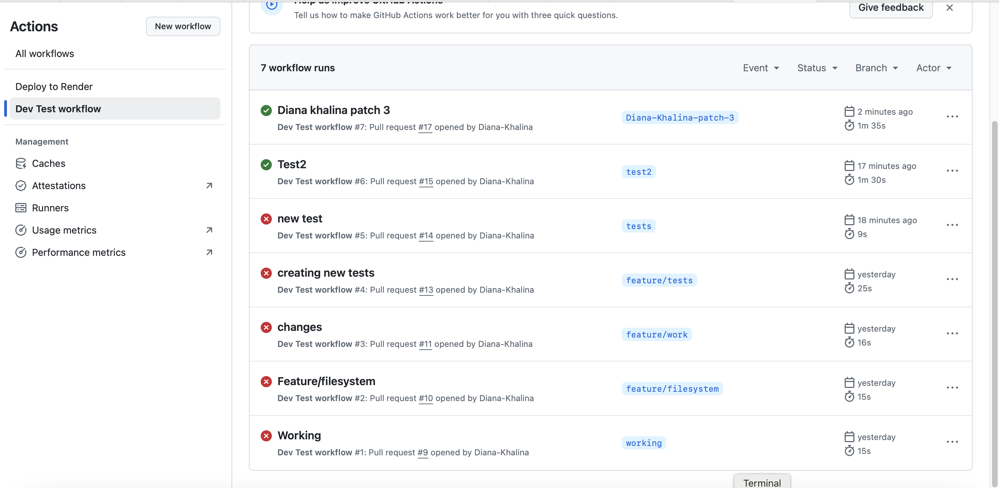
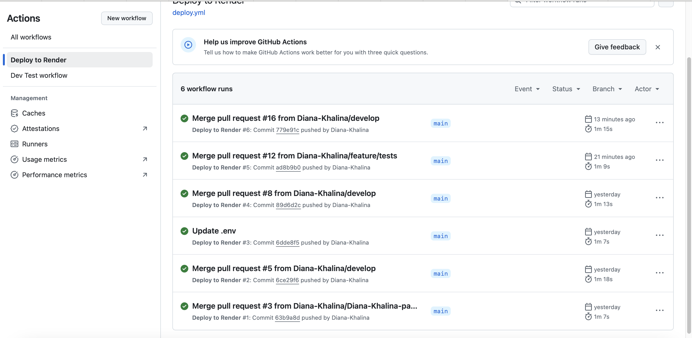

# Challenge-20
# AutoQuizActions
 This project using continuous integration and continuous delivery/deployment (CI/CD) into an existing quiz application. The application, built using the MERN stack (MongoDB, Express.js, React, Node.js), allows users to take a tech quiz, view random questions, and see their score at the end.

## Features
- **Component Testing**: Verifies individual Quiz component, ensuring it functions correctly in isolation.
- **End-to-End Testing**: Simulates the full user journey from starting the quiz to viewing the final score, ensuring the app works as intended.
- **CI/CD**: Testing is completed and passed before the code is merged with main and deployed to the live production environment using GitHub Actions
## [Usage](#usage)
  See live application here: [AutoQuizActions](https://challenge-20-o4kt.onrender.com).

  ### Application Screenshot
  GitHub Actions for tests
  
  GitHub Actions for deployments
  

## Tech Stack

- **GitHub Actions** — CI/CD automation
- **Cypress** — End-to-end/component testing
- **Render** — Deployment platform
- **Node.js, npm** — Dependency management

## License

This project is open-source and available under the **MIT License**.

  
  
